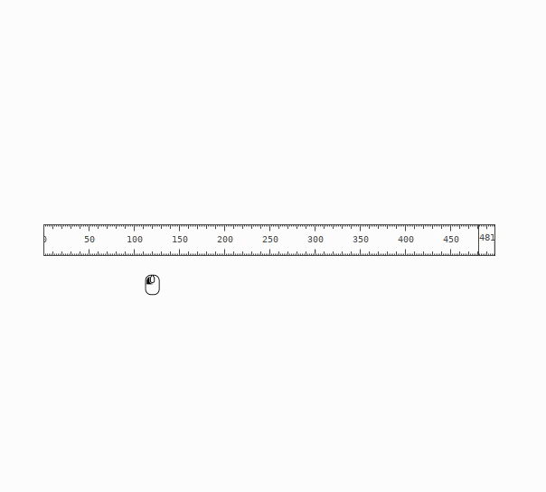
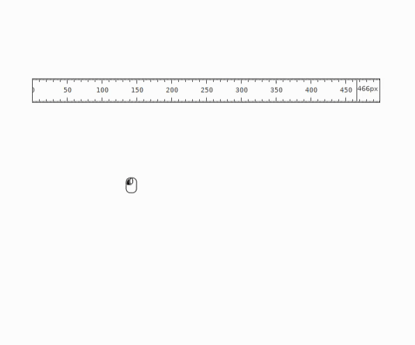

# `rlr`: a pixel screen ruler

 [](https://github.com/epilys/rlr/blob/master/LICENSE) [](https://crates.io/crates/rlr-gtk)


Rust + GTK interactive pixel screen ruler with protractor mode.

```shell
cargo install rlr-gtk
```

Alternatively, a flatpak manifest file is included so that you can build and install as a flatpak bundle.

## Demo

<table>
<tr><td colspan=2 align="center"><kbd>


</kbd></tr><tr><td><kbd>



</kbd></td><td><kbd>



</kbd></td></tr></table>

## Use

To use application settings, the app's settings schema but be installed in your system.
It is possible to attempt to do this automatically via the Settings menu, which will install the schema to `${HOME}/.local/share/glib-2.0/schemas/` and subsequently attempt to compile it; but the directory must exist beforehand, it won't be created.

`rlr` includes a command-line argument `--install-gsettings-schema` that creates the settings schema at the given directory.
If directory is `-`, it will be printed to standard output instead.

*Note*: The directory values should probably be one of: `${HOME}/.local/share/glib-2.0/schemas/`, `/usr/share/glib-2.0/schemas/` or similar.

For the settings schema to be discoverable, it must be compiled with `glib-compile-schemas`.

An example usage:

```shell
rlr --install-gsettings-schema "${HOME}/.local/share/glib-2.0/schemas/"
```

and then:

```shell
glib-compile-schemas "${HOME}/.local/share/glib-2.0/schemas/"
```

### Shortcuts

If you are on macOS, use <kbd>⌘</kbd> (Command) key instead of <kbd>Ctrl</kbd>.

- **Quit** with <kbd>q</kbd> or <kbd>Ctrl</kbd> + <kbd>Q</kbd>.
- Click to **drag**.
- Press <kbd>?</kbd> or <kbd>F1</kbd> to **open the About and Help window**.
- Press <kbd>s</kbd> or <kbd>F2</kbd> to **open the Settings window**.
- Press <kbd>r</kbd> to **rotate** 90 degrees. Press <kbd>Shift</kbd> + <kbd>r</kbd> to **flip (mirror)** the marks without rotation.
- Press <kbd>p</kbd> to toggle **protractor mode**.
- Press <kbd>f</kbd> or <kbd>Space</kbd> to toggle **freezing the measurements**.
- Press <kbd>Ctrl</kbd> and drag the angle base side to **rotate it while in protractor mode**.
- Press <kbd>Ctrl</kbd> continuously to **disable precision** (measurements will snap to nearest integer).
- Press <kbd>+</kbd> to **increase size**. Press <kbd>-</kbd> to **decrease size**.
- Press <kbd>Ctrl</kbd> + <kbd>+</kbd>, <kbd>Ctrl</kbd> + <kbd>+</kbd> to **increase font size**. Press <kbd>Ctrl</kbd> + <kbd>-</kbd>, <kbd>Ctrl</kbd> + <kbd>-</kbd> to **decrease font size**.
- Press <kbd>Up</kbd>, <kbd>Down</kbd>, <kbd>Left</kbd>, <kbd>Right</kbd> to **move window position by 10 pixels**. Also hold down <kbd>Ctrl</kbd> to **move by 1 pixel**.

## Build

```shell
cargo build --release
```

Build as flatpak and install:

```shell
flatpak-builder --install repo com.github.epilys.rlr.json --force-clean --user -y
```

Afterwards you can run from your desktop's application menu (under category "Graphics") or from the terminal with:

```shell
flatpak run com.github.epilys.rlr
```

## Packaging

To help packagers in OSes that support the XDG Desktop standards, a `.desktop`
app launcher filer, an application icon and a symbolic application icon are
included.

- `data/com.github.epilys.rlr.desktop` should be installed in any of the following:
  `/usr/share/applications/`, `/usr/local/share/applications/` or
  `$HOME/.local/share/applications/`.
- `data/com.github.epilys.rlr.svg` should be installed in
  `/usr/share/icons/hicolor/scalable/apps/com.github.epilys.rlr.svg`.
- `data/com.github.epilys.rlr.symbolic.svg` should be installed in
  `/usr/share/icons/hicolor/symbolic/apps/com.github.epilys.rlr.svg`.

The files have been contributed by <https://github.com/somepaulo>.
