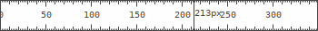

# `rlr`: a pixel screen ruler




## use

- Quit with `q` or `Ctrl-Q`.
- Click to drag.
- Press `r` to rotate 90 degrees.
- Press `p` to toggle protractor mode.
- Press `Control_L` continuously to disable precision (measurements will snap to nearest integer).

## build

```shell
cargo build --release
```
